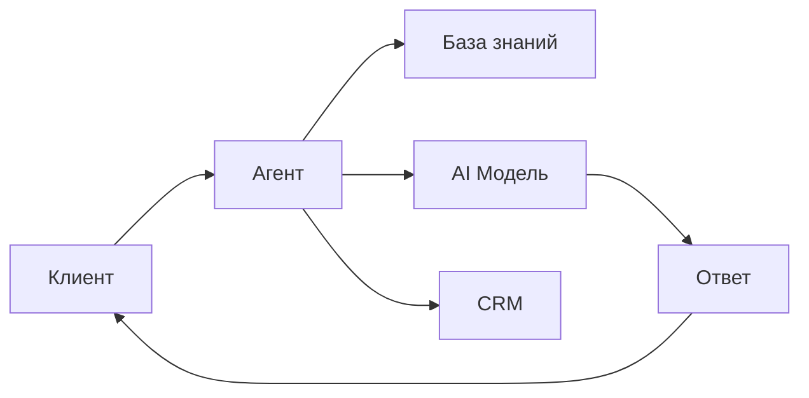

# 📋 ДЕТАЛЬНЫЙ ПЛАН РЕАЛИЗАЦИИ - ЧАСТЬ 2

**Продолжение**: Documentation, Test Chat, Knowledge Base, UX

---

## 📅 WEEK 1: DOCUMENTATION (20 часов) - продолжение

### 📚 ЗАДАЧА 5: GETTING STARTED DOCUMENTATION (20 часов)

#### 5.1 Setup documentation structure (4 hours)

##### ШАГ 1: Create docs layout (1h)
```typescript
// Создать файл: app/docs/ru/layout.tsx

import { DocsNav } from '@/components/docs/DocsNav'
import { DocsSearch } from '@/components/docs/DocsSearch'

export default function DocsLayout({
  children
}: {
  children: React.ReactNode
}) {
  return (
    <div className="flex min-h-screen">
      {/* Sidebar */}
      <aside className="w-64 border-r bg-muted/10 sticky top-0 h-screen overflow-y-auto">
        <div className="p-6">
          <h2 className="text-lg font-semibold mb-4">Документация</h2>
          <DocsSearch />
          <DocsNav />
        </div>
      </aside>

      {/* Main content */}
      <main className="flex-1 overflow-y-auto">
        <div className="container max-w-4xl py-8 px-6">
          {children}
        </div>
      </main>
    </div>
  )
}

// Создать файл: app/docs/ru/page.tsx

import { redirect } from 'next/navigation'

export default function DocsPage() {
  // Redirect to Getting Started
  redirect('/docs/ru/getting-started/introduction')
}
```

##### ШАГ 2: Create navigation component (1.5h)
```typescript
// Создать файл: components/docs/DocsNav.tsx

'use client'

import Link from 'next/link'
import { usePathname } from 'next/navigation'
import { cn } from '@/lib/utils'
import {
  ChevronDown,
  ChevronRight,
  BookOpen,
  Rocket,
  Settings,
  Code,
  HelpCircle
} from 'lucide-react'
import { useState } from 'react'

interface NavItem {
  title: string
  href?: string
  icon?: React.ComponentType<{ className?: string }>
  items?: NavItem[]
}

const docsNav: NavItem[] = [
  {
    title: 'Начало работы',
    icon: Rocket,
    items: [
      {
        title: 'Введение',
        href: '/docs/ru/getting-started/introduction'
      },
      {
        title: 'Быстрый старт',
        href: '/docs/ru/getting-started/quick-start'
      },
      {
        title: 'Первый агент',
        href: '/docs/ru/getting-started/first-agent'
      },
      {
        title: 'Тестовый чат',
        href: '/docs/ru/getting-started/test-chat'
      }
    ]
  },
  {
    title: 'Возможности',
    icon: BookOpen,
    items: [
      {
        title: 'AI Агенты',
        href: '/docs/ru/features/ai-agents'
      },
      {
        title: 'База знаний',
        href: '/docs/ru/features/knowledge-base'
      },
      {
        title: 'Интеграции',
        href: '/docs/ru/features/integrations'
      },
      {
        title: 'Аналитика',
        href: '/docs/ru/features/analytics'
      }
    ]
  },
  {
    title: 'Интеграции',
    icon: Settings,
    items: [
      {
        title: 'Kommo CRM',
        href: '/docs/ru/integrations/kommo'
      },
      {
        title: 'Instagram',
        href: '/docs/ru/integrations/instagram'
      },
      {
        title: 'Facebook',
        href: '/docs/ru/integrations/facebook'
      }
    ]
  },
  {
    title: 'API',
    icon: Code,
    items: [
      {
        title: 'Аутентификация',
        href: '/docs/ru/api/authentication'
      },
      {
        title: 'Endpoints',
        href: '/docs/ru/api/endpoints'
      },
      {
        title: 'Webhooks',
        href: '/docs/ru/api/webhooks'
      }
    ]
  },
  {
    title: 'Помощь',
    icon: HelpCircle,
    items: [
      {
        title: 'Частые вопросы',
        href: '/docs/ru/help/faq'
      },
      {
        title: 'Решение проблем',
        href: '/docs/ru/help/troubleshooting'
      }
    ]
  }
]

function NavSection({ item }: { item: NavItem }) {
  const [isOpen, setIsOpen] = useState(true)
  const pathname = usePathname()

  const Icon = item.icon

  if (!item.items) {
    return (
      <Link
        href={item.href!}
        className={cn(
          'block px-3 py-2 rounded-md text-sm hover:bg-muted transition-colors',
          pathname === item.href && 'bg-muted font-medium'
        )}
      >
        {item.title}
      </Link>
    )
  }

  return (
    <div className="mb-4">
      <button
        onClick={() => setIsOpen(!isOpen)}
        className="flex items-center justify-between w-full px-3 py-2 text-sm font-medium rounded-md hover:bg-muted transition-colors"
      >
        <div className="flex items-center gap-2">
          {Icon && <Icon className="h-4 w-4" />}
          <span>{item.title}</span>
        </div>
        {isOpen ? (
          <ChevronDown className="h-4 w-4" />
        ) : (
          <ChevronRight className="h-4 w-4" />
        )}
      </button>

      {isOpen && (
        <div className="mt-1 ml-2 pl-4 border-l space-y-1">
          {item.items.map((subItem) => (
            <Link
              key={subItem.href}
              href={subItem.href!}
              className={cn(
                'block px-3 py-2 rounded-md text-sm hover:bg-muted transition-colors',
                pathname === subItem.href && 'bg-muted font-medium text-primary'
              )}
            >
              {subItem.title}
            </Link>
          ))}
        </div>
      )}
    </div>
  )
}

export function DocsNav() {
  return (
    <nav className="mt-6">
      {docsNav.map((item) => (
        <NavSection key={item.title} item={item} />
      ))}
    </nav>
  )
}
```

##### ШАГ 3: Create search component (1.5h)
```typescript
// Создать файл: components/docs/DocsSearch.tsx

'use client'

import { useState, useEffect, useCallback } from 'react'
import { useRouter } from 'next/navigation'
import { Input } from '@/components/ui/input'
import { Dialog, DialogContent } from '@/components/ui/dialog'
import { Search, FileText } from 'lucide-react'
import Fuse from 'fuse.js'
import { docsSearchIndex } from '@/lib/docs/search-index'

export function DocsSearch() {
  const [isOpen, setIsOpen] = useState(false)
  const [query, setQuery] = useState('')
  const [results, setResults] = useState<any[]>([])
  const router = useRouter()

  // Keyboard shortcut (Cmd+K or Ctrl+K)
  useEffect(() => {
    const down = (e: KeyboardEvent) => {
      if (e.key === 'k' && (e.metaKey || e.ctrlKey)) {
        e.preventDefault()
        setIsOpen((open) => !open)
      }
    }

    document.addEventListener('keydown', down)
    return () => document.removeEventListener('keydown', down)
  }, [])

  // Search using Fuse.js
  const search = useCallback((searchQuery: string) => {
    if (!searchQuery.trim()) {
      setResults([])
      return
    }

    const fuse = new Fuse(docsSearchIndex, {
      keys: ['title', 'content', 'keywords'],
      threshold: 0.3,
      includeScore: true
    })

    const searchResults = fuse.search(searchQuery).slice(0, 10)
    setResults(searchResults.map(r => r.item))
  }, [])

  useEffect(() => {
    search(query)
  }, [query, search])

  const handleSelect = (href: string) => {
    setIsOpen(false)
    setQuery('')
    router.push(href)
  }

  return (
    <>
      {/* Search trigger button */}
      <button
        onClick={() => setIsOpen(true)}
        className="w-full flex items-center gap-2 px-3 py-2 text-sm text-muted-foreground border rounded-md hover:bg-muted transition-colors"
      >
        <Search className="h-4 w-4" />
        <span className="flex-1 text-left">Поиск...</span>
        <kbd className="hidden sm:inline-flex h-5 items-center gap-1 rounded border bg-muted px-1.5 font-mono text-xs">
          <span className="text-xs">⌘</span>K
        </kbd>
      </button>

      {/* Search dialog */}
      <Dialog open={isOpen} onOpenChange={setIsOpen}>
        <DialogContent className="max-w-2xl p-0">
          <div className="flex items-center border-b px-4 py-3">
            <Search className="h-4 w-4 mr-2 text-muted-foreground" />
            <Input
              value={query}
              onChange={(e) => setQuery(e.target.value)}
              placeholder="Поиск в документации..."
              className="border-0 shadow-none focus-visible:ring-0"
              autoFocus
            />
          </div>

          {/* Search results */}
          {results.length > 0 ? (
            <div className="max-h-96 overflow-y-auto p-2">
              {results.map((result, index) => (
                <button
                  key={index}
                  onClick={() => handleSelect(result.href)}
                  className="w-full flex items-start gap-3 px-3 py-2 rounded-md hover:bg-muted transition-colors text-left"
                >
                  <FileText className="h-4 w-4 mt-1 text-muted-foreground flex-shrink-0" />
                  <div>
                    <div className="font-medium text-sm">{result.title}</div>
                    <div className="text-xs text-muted-foreground line-clamp-2 mt-1">
                      {result.description}
                    </div>
                  </div>
                </button>
              ))}
            </div>
          ) : query ? (
            <div className="p-8 text-center text-sm text-muted-foreground">
              Ничего не найдено
            </div>
          ) : (
            <div className="p-8 text-center text-sm text-muted-foreground">
              Начните печатать для поиска...
            </div>
          )}
        </DialogContent>
      </Dialog>
    </>
  )
}

// Создать файл: lib/docs/search-index.ts

export const docsSearchIndex = [
  {
    title: 'Введение',
    href: '/docs/ru/getting-started/introduction',
    description: 'Общий обзор платформы и ключевые возможности',
    content: 'платформа ai агенты автоматизация',
    keywords: ['введение', 'обзор', 'начало']
  },
  {
    title: 'Быстрый старт',
    href: '/docs/ru/getting-started/quick-start',
    description: 'Пошаговое руководство для начала работы',
    content: 'создание аккаунта настройка первые шаги',
    keywords: ['старт', 'начало', 'setup']
  },
  // ... остальные страницы добавятся при создании контента
]
```

**Acceptance Criteria:**
- ✅ Layout работает с sidebar
- ✅ Navigation показывает все разделы
- ✅ Search работает с Cmd+K
- ✅ Mobile responsive

---

#### 5.2 Write Getting Started content (12 hours)

##### ШАГ 1: Introduction (2h)
```markdown
Создать файл: app/docs/ru/getting-started/introduction/page.mdx

---
title: Введение в платформу
description: Узнайте о возможностях платформы AI агентов
---

# Введение в платформу

Добро пожаловать в платформу для создания и управления AI агентами!

## Что это такое?

Платформа позволяет создавать умных AI агентов, которые могут:

- 🤖 Автоматически отвечать на вопросы клиентов
- 📚 Использовать вашу базу знаний для точных ответов
- 🔗 Интегрироваться с CRM системами (Kommo, amoCRM)
- 📱 Работать в социальных сетях (Instagram, Facebook)
- 📊 Предоставлять подробную аналитику

## Ключевые возможности

### AI Агенты

Создавайте агентов на базе передовых языковых моделей:
- GPT-4, GPT-3.5 Turbo
- Claude 3 Opus
- И другие модели через OpenRouter

### База знаний

Загружайте документы и файлы:
- PDF, Word, текстовые файлы
- Автоматическая векторизация
- Умный поиск по контенту

### Интеграции

Подключайте популярные сервисы:
- Kommo CRM (amoCRM)
- Instagram Direct
- Facebook Messenger
- Webhooks для любых систем

### Аналитика

Отслеживайте эффективность:
- Количество обращений
- Время ответа
- Качество ответов
- Стоимость API вызовов

## Как это работает?



1. **Клиент** задает вопрос через чат/соцсети
2. **Агент** ищет релевантную информацию в базе знаний
3. **AI модель** генерирует ответ на основе контекста
4. **Ответ** отправляется клиенту
5. **Данные** сохраняются в CRM

## Следующие шаги

<Cards>
  <Card
    title="Быстрый старт"
    href="/docs/ru/getting-started/quick-start"
    description="Создайте первого агента за 5 минут"
  />
  <Card
    title="Первый агент"
    href="/docs/ru/getting-started/first-agent"
    description="Пошаговое руководство"
  />
  <Card
    title="Возможности"
    href="/docs/ru/features/ai-agents"
    description="Подробнее о функциях"
  />
</Cards>

## Нужна помощь?

- 📖 [Частые вопросы](/docs/ru/help/faq)
- 🐛 [Решение проблем](/docs/ru/help/troubleshooting)
- 💬 [Поддержка](mailto:support@example.com)
```

##### ШАГ 2: Quick Start (3h)
```markdown
Создать файл: app/docs/ru/getting-started/quick-start/page.mdx

---
title: Быстрый старт
description: Начните работу за 5 минут
---

# Быстрый старт

Создайте своего первого AI агента всего за 5 минут!

## Шаг 1: Создание аккаунта

1. Перейдите на страницу регистрации
2. Введите email и пароль
3. Подтвердите email (проверьте почту)

<Callout type="info">
  💡 Используйте рабочий email - на него придут важные уведомления
</Callout>

## Шаг 2: Настройка организации

После входа вы попадете в настройку организации:

1. Введите название компании
2. Выберите отрасль (опционально)
3. Пригласите команду (опционально)


## Шаг 3: Создание первого агента

Теперь создадим вашего первого AI агента:

1. Нажмите **"Создать агента"**
2. Заполните форму:

```typescript
{
  name: "Помощник службы поддержки",
  description: "Отвечает на частые вопросы клиентов",
  model: "gpt-3.5-turbo",
  systemPrompt: `Ты - помощник службы поддержки компании.
    Отвечай вежливо и профессионально.
    Если не знаешь ответ - предложи связаться с оператором.`,
  temperature: 0.7,
  maxTokens: 500
}
```

3. Нажмите **"Создать"**

<Callout type="success">
  ✅ Поздравляем! Ваш первый агент создан!
</Callout>

## Шаг 4: Тестирование

Протестируйте агента в **Тестовом чате**:

1. Откройте **Test Chat** в меню
2. Выберите вашего агента
3. Напишите тестовое сообщение
4. Получите ответ от AI


### Примеры вопросов:

- "Какие у вас часы работы?"
- "Как вернуть товар?"
- "Какие способы оплаты вы принимаете?"

## Шаг 5: Подключение базы знаний (опционально)

Сделайте ответы точнее, добавив документы:

1. Откройте **База знаний**
2. Нажмите **"Загрузить файлы"**
3. Выберите PDF/Word документы
4. Дождитесь обработки

Теперь агент будет использовать эти документы для ответов!

## Шаг 6: Интеграция с CRM (опционально)

Подключите Kommo CRM:

1. Откройте **Интеграции → Kommo**
2. Нажмите **"Подключить"**
3. Авторизуйтесь в Kommo
4. Выберите воронки и поля

Агент будет автоматически создавать сделки!

## Что дальше?

<Cards>
  <Card
    title="Первый агент"
    href="/docs/ru/getting-started/first-agent"
    description="Детальное руководство по настройке"
  />
  <Card
    title="База знаний"
    href="/docs/ru/features/knowledge-base"
    description="Как загружать документы"
  />
  <Card
    title="Интеграции"
    href="/docs/ru/integrations/kommo"
    description="Настройка Kommo CRM"
  />
</Cards>

## Частые вопросы

### Сколько агентов можно создать?

В бесплатном тарифе - до 3 агентов.
В платных тарифах - без ограничений.

### Какие модели AI доступны?

- GPT-4 (самая умная)
- GPT-3.5 Turbo (быстрая и дешевая)
- Claude 3 Opus (альтернатива GPT-4)

### Сколько это стоит?

Платите только за использование AI моделей:
- GPT-3.5: ~$0.002 за ответ
- GPT-4: ~$0.06 за ответ

Подробнее на странице [Тарифы](/pricing).
```

##### ШАГ 3: First Agent guide (3h)
```markdown
Создать файл: app/docs/ru/getting-started/first-agent/page.mdx

---
title: Создание первого агента
description: Подробное руководство по настройке AI агента
---

# Создание первого агента

Пошаговое руководство по созданию и настройке вашего первого AI агента.

## Подготовка

Перед созданием агента определите:

1. **Цель**: Что должен делать агент?
   - Отвечать на вопросы
   - Консультировать клиентов
   - Собирать заявки

2. **Тон общения**: Как должен общаться агент?
   - Формальный / Неформальный
   - Дружелюбный / Профессиональный

3. **Источники информации**:
   - Документы компании
   - FAQ
   - Прайс-листы

## Создание агента

### Шаг 1: Основные настройки

Откройте **AI Агенты → Создать**

#### Название и описание

```
Название: Помощник интернет-магазина
Описание: Консультирует по товарам, помогает с заказом и доставкой
```

<Callout type="tip">
  💡 Название должно быть понятным - вы будете видеть его в списке агентов
</Callout>

#### Выбор модели

| Модель | Скорость | Качество | Цена | Когда использовать |
|--------|----------|----------|------|-------------------|
| GPT-3.5 Turbo | ⚡⚡⚡ | ⭐⭐ | $ | Простые вопросы, FAQ |
| GPT-4 | ⚡ | ⭐⭐⭐ | $$$ | Сложные консультации |
| Claude 3 Opus | ⚡⚡ | ⭐⭐⭐ | $$$ | Длинные тексты |

**Рекомендация**: Начните с GPT-3.5 Turbo. Если качество недостаточное - переключитесь на GPT-4.

### Шаг 2: System Prompt (главное!)

System Prompt - это инструкция для AI. От неё зависит 80% качества ответов.

#### Хороший пример:

\`\`\`
Ты - помощник интернет-магазина "УютДом".

Твоя роль:
- Консультировать по товарам
- Помогать оформить заказ
- Отвечать на вопросы о доставке

Правила:
- Отвечай вежливо и профессионально
- Используй информацию из базы знаний
- Если не знаешь ответ - предложи связаться с оператором
- Не придумывай цены - используй актуальный прайс

Стиль общения:
- Дружелюбный, но профессиональный
- Обращайся на "Вы"
- Используй эмодзи умеренно (1-2 на сообщение)

Информация о компании:
- Доставка: по Москве 1-2 дня, по России 3-7 дней
- Оплата: картой онлайн, наличными курьеру
- Часы работы: пн-пт 9:00-18:00
- Телефон поддержки: +7 (495) 123-45-67
\`\`\`

<Callout type="warning">
  ⚠️ Плохой пример: "Ты помощник. Отвечай на вопросы."
  Слишком общее - агент не будет знать как отвечать.
</Callout>

### Шаг 3: Параметры генерации

#### Temperature (креативность)

```
0.0 - Максимально предсказуемо (для FAQ, инструкций)
0.7 - Сбалансировано (по умолчанию)
1.0 - Креативно (для маркетинговых текстов)
```

**Рекомендация**: Оставьте 0.7 для начала.

#### Max Tokens (длина ответа)

```
100-200  - Короткие ответы (FAQ)
500      - Средние ответы (консультации)
1000+    - Длинные ответы (статьи, инструкции)
```

**Рекомендация**: 500 токенов достаточно для большинства случаев.

### Шаг 4: База знаний

Загрузите документы для улучшения точности:

1. **Что загрузить**:
   - FAQ компании
   - Описания товаров/услуг
   - Инструкции
   - Политики (возврат, доставка)

2. **Как загрузить**:
   ```
   База знаний → Загрузить → Выберите файлы (PDF/Word/TXT)
   ```

3. **Дождитесь обработки** (~2-5 минут на документ)

<Callout type="info">
  💡 Агент автоматически найдет релевантную информацию из документов
</Callout>

### Шаг 5: Интеграции

#### Kommo CRM

Настройте автоматическое создание сделок:

1. **Подключите Kommo**:
   ```
   Интеграции → Kommo → Подключить
   ```

2. **Настройте поля**:
   - Воронка: "Заявки с сайта"
   - Ответственный: "Распределить автоматически"
   - Статус: "Новая заявка"

3. **Триггеры создания**:
   ```javascript
   {
     trigger: "user_mentions_order",
     action: "create_lead",
     fields: {
       name: "[извлечь из чата]",
       phone: "[запросить у клиента]",
       product: "[о чем был разговор]"
     }
   }
   ```

## Тестирование

### Test Chat

1. Откройте **Test Chat**
2. Выберите вашего агента
3. Протестируйте разные сценарии:

```
✅ Тест 1: Простой вопрос
User: "Какие у вас часы работы?"
Agent: "Мы работаем пн-пт с 9:00 до 18:00"

✅ Тест 2: Вопрос по товару
User: "Сколько стоит диван БРИМНЭС?"
Agent: [должен найти в базе знаний]

✅ Тест 3: Оформление заказа
User: "Хочу заказать этот диван"
Agent: "Отлично! Для оформления заказа нужны..."
```

### Что проверять

- [ ] Агент отвечает в нужном тоне
- [ ] Использует информацию из базы знаний
- [ ] Не придумывает факты
- [ ] Вежливо отказывается если не знает ответ
- [ ] Создает сделки в CRM (если настроено)

## Оптимизация

### Если ответы слишком общие

➜ Улучшите system prompt:
- Добавьте больше деталей о компании
- Укажите конкретные примеры ответов

### Если агент "придумывает"

➜ Добавьте в prompt:
```
ВАЖНО: Используй ТОЛЬКО информацию из базы знаний.
Если информации нет - честно скажи "Не знаю".
```

### Если ответы слишком длинные

➜ Уменьшите max tokens до 300-400

### Если пропускает CRM сделки

➜ Проверьте триггеры:
- Достаточно ли явный триггер?
- Правильно ли настроены поля?

## Checklist готовности

Перед запуском в production убедитесь:

- [ ] System prompt детально описывает роль
- [ ] Загружены все необходимые документы
- [ ] Протестированы основные сценарии
- [ ] Настроены интеграции (CRM, соцсети)
- [ ] Определены fallback сценарии
- [ ] Команда знает как мониторить агента

## Следующие шаги

<Cards>
  <Card
    title="База знаний"
    href="/docs/ru/features/knowledge-base"
    description="Как правильно загружать документы"
  />
  <Card
    title="Интеграции"
    href="/docs/ru/integrations/kommo"
    description="Детальная настройка Kommo"
  />
  <Card
    title="Аналитика"
    href="/docs/ru/features/analytics"
    description="Отслеживайте эффективность"
  />
</Cards>
```

##### ШАГ 4: Test Chat guide (2h)
```markdown
Создать файл: app/docs/ru/getting-started/test-chat/page.mdx

---
title: Тестовый чат
description: Как использовать тестовый чат для проверки агентов
---

# Тестовый чат

Тестовый чат позволяет проверить работу агентов перед запуском в production.

## Зачем нужен

- ✅ Проверить качество ответов
- ✅ Протестировать разные сценарии
- ✅ Отладить base знаний
- ✅ Проверить триггеры CRM
- ✅ Измерить время ответа

## Как использовать

### Открыть Test Chat

1. В меню выберите **Test Chat**
2. Выберите агента из списка
3. Начните диалог


### Основные функции

#### Выбор агента

```typescript
// Выпадающий список всех агентов
<AgentSelector>
  - Помощник поддержки
  - Продажи в Instagram
  - Консультант по товарам
</AgentSelector>
```

#### История сообщений

- Все сообщения сохраняются
- Можно просмотреть старые диалоги
- Экспорт в текстовый файл

#### Очистить диалог

Начните новый разговор с чистого листа:
```
Кнопка "Очистить" → Подтверждение → Новый диалог
```

## Сценарии тестирования

### 1. Базовые вопросы

Проверьте простые FAQ:

```
User: "Какие у вас часы работы?"
Agent: "Мы работаем пн-пт с 9:00 до 18:00"

✅ Ответ правильный
✅ Тон вежливый
✅ Информация актуальная
```

### 2. Вопросы по базе знаний

Проверьте поиск в документах:

```
User: "Сколько стоит доставка в Санкт-Петербург?"
Agent: [должен найти в загруженном прайсе]

✅ Нашел информацию
✅ Указал точную цену
✅ Не придумал данные
```

### 3. Сложные сценарии

Задайте неоднозначный вопрос:

```
User: "У вас есть красный?"
Agent: "Какой именно товар вас интересует?"

✅ Уточняет детали
✅ Не угадывает
```

### 4. Триггеры CRM

Проверьте создание сделок:

```
User: "Хочу заказать диван"
Agent: "Отлично! Для оформления..."

→ Проверить в Kommo: создалась ли сделка?
```

## Анализ ответов

### Что проверять

| Критерий | Как проверить | Норма |
|----------|---------------|-------|
| Скорость | Время ответа | < 3 сек |
| Точность | Соответствие фактам | 100% |
| Тон | Соответствие бренду | Субъективно |
| Полнота | Ответил ли на вопрос | ✅ |

### Типичные проблемы

#### Агент "фантазирует"

❌ Проблема:
```
User: "Сколько стоит товар X?"
Agent: "Примерно 5000 рублей" (придумал!)
```

✅ Решение:
```
System Prompt:
"НИКОГДА не придумывай цены.
Используй ТОЛЬКО данные из базы знаний.
Если цены нет - скажи 'Уточню у менеджера'."
```

#### Ответы слишком общие

❌ Проблема:
```
User: "Расскажите о доставке"
Agent: "У нас есть доставка" (слишком кратко)
```

✅ Решение:
- Добавить детали в system prompt
- Загрузить полный документ о доставке

#### Не создает CRM сделки

❌ Проблема: Клиент запросил заказ, но сделка не создалась

✅ Решение:
- Проверить триггеры в настройках
- Убедиться что Kommo подключен
- Проверить логи ошибок

## Debug режим

### Включить подробные логи

```typescript
// Настройки агента → Advanced
{
  debugMode: true,
  logLevel: 'detailed'
}
```

Вы увидите:
- Какие документы использовались
- Сколько токенов потрачено
- Время обработки каждого шага

## Export & Sharing

### Экспорт диалога

```
Кнопка "Экспорт" →
  - Текстовый файл (.txt)
  - JSON (.json)
  - Скриншот (.png)
```

### Поделиться с командой

```
Кнопка "Поделиться" →
  - Ссылка на диалог
  - Копировать текст
  - Email команде
```

## Best Practices

### Регулярное тестирование

Тестируйте агента:
- ✅ После изменений в system prompt
- ✅ После загрузки новых документов
- ✅ После обновления интеграций
- ✅ Минимум раз в неделю

### Тестовые наборы

Создайте список типовых вопросов:

```markdown
## Тестовый набор "Поддержка"

1. Какие часы работы?
2. Как вернуть товар?
3. Способы оплаты?
4. Сроки доставки?
5. Как отменить заказ?

Проверять каждый раз при изменениях!
```

### A/B тестирование

Сравните разные варианты:

```
Агент A (formal):
"Здравствуйте! Чем могу помочь?"

Агент B (casual):
"Привет! Что тебя интересует?"

→ Запустите оба, сравните метрики
```

## Troubleshooting

### Агент не отвечает

1. Проверить статус агента (активен ли?)
2. Проверить API ключи (OpenRouter работает?)
3. Проверить логи (есть ли ошибки?)

### Очень долгие ответы

1. Снизить max tokens
2. Упростить system prompt
3. Переключиться на более быструю модель

### Ошибки при ответе

```
Error: Rate limit exceeded
→ Подождите 1 минуту

Error: Invalid API key
→ Проверьте настройки OpenRouter

Error: Model not available
→ Выберите другую модель
```

## Что дальше?

<Cards>
  <Card
    title="Запуск в production"
    href="/docs/ru/features/integrations"
    description="Подключите реальные каналы"
  />
  <Card
    title="Мониторинг"
    href="/docs/ru/features/analytics"
    description="Отслеживайте метрики"
  />
</Cards>
```

##### ШАГ 5: Features documentation (2h)
```markdown
Создать файлы:
- app/docs/ru/features/ai-agents/page.mdx
- app/docs/ru/features/knowledge-base/page.mdx
- app/docs/ru/features/integrations/page.mdx
- app/docs/ru/features/analytics/page.mdx

(Аналогичная структура, 1000-1500 слов каждый)
```

**Acceptance Criteria для всей документации:**
- ✅ Минимум 10 статей написано
- ✅ Code examples работают
- ✅ Screenshots добавлены (можно placeholders)
- ✅ SEO метаданные заполнены
- ✅ Mobile отображение корректно

---

#### 5.3 Search implementation (4 hours)

##### ШАГ 1: Install dependencies (15 min)
```bash
npm install fuse.js
npm install --save-dev @types/fuse.js
```

##### ШАГ 2: Build search index (2h)
```typescript
// Создать файл: lib/docs/build-search-index.ts

import fs from 'fs'
import path from 'path'
import matter from 'gray-matter'

interface DocPage {
  title: string
  description: string
  href: string
  content: string
  keywords: string[]
  category: string
}

export async function buildSearchIndex(): Promise<DocPage[]> {
  const docsDir = path.join(process.cwd(), 'app/docs/ru')
  const pages: DocPage[] = []

  // Рекурсивная функция для обхода директорий
  function walkDir(dir: string, category: string = '') {
    const files = fs.readdirSync(dir)

    for (const file of files) {
      const filePath = path.join(dir, file)
      const stat = fs.statSync(filePath)

      if (stat.isDirectory()) {
        walkDir(filePath, file)
      } else if (file.endsWith('.mdx') || file.endsWith('.md')) {
        // Parse MDX file
        const content = fs.readFileSync(filePath, 'utf-8')
        const { data, content: mdContent } = matter(content)

        // Extract route from file path
        const route = filePath
          .replace(docsDir, '')
          .replace(/\\/g, '/')
          .replace(/\/page\.mdx?$/, '')
          .replace(/\.mdx?$/, '')

        pages.push({
          title: data.title || 'Untitled',
          description: data.description || '',
          href: `/docs/ru${route}`,
          content: mdContent.substring(0, 500), // First 500 chars
          keywords: data.keywords || [],
          category: category || 'Uncategorized'
        })
      }
    }
  }

  walkDir(docsDir)

  return pages
}

// Создать файл: scripts/build-search-index.ts

import { buildSearchIndex } from '../lib/docs/build-search-index'
import fs from 'fs'
import path from 'path'

async function main() {
  console.log('Building search index...')

  const index = await buildSearchIndex()

  const outputPath = path.join(
    process.cwd(),
    'lib/docs/search-index.json'
  )

  fs.writeFileSync(outputPath, JSON.stringify(index, null, 2))

  console.log(`✅ Search index built: ${index.length} pages`)
  console.log(`Saved to: ${outputPath}`)
}

main()

// Добавить npm script
// package.json:
{
  "scripts": {
    "docs:build-index": "tsx scripts/build-search-index.ts"
  }
}
```

##### ШАГ 3: Update search component to use index (1h)
```typescript
// Обновить файл: components/docs/DocsSearch.tsx

'use client'

import { useState, useEffect, useCallback } from 'react'
import Fuse from 'fuse.js'
import searchIndex from '@/lib/docs/search-index.json'

export function DocsSearch() {
  // ... existing code

  // Initialize Fuse.js
  const fuse = useMemo(() => {
    return new Fuse(searchIndex, {
      keys: [
        { name: 'title', weight: 2 },
        { name: 'description', weight: 1.5 },
        { name: 'content', weight: 1 },
        { name: 'keywords', weight: 1.5 }
      ],
      threshold: 0.3,
      includeScore: true,
      minMatchCharLength: 2
    })
  }, [])

  const search = useCallback((searchQuery: string) => {
    if (!searchQuery.trim()) {
      setResults([])
      return
    }

    const searchResults = fuse.search(searchQuery).slice(0, 10)
    setResults(searchResults.map(r => r.item))
  }, [fuse])

  // ... rest of code
}
```

##### ШАГ 4: Test search (45 min)
```typescript
// Создать файл: lib/docs/search.test.ts

import Fuse from 'fuse.js'
import searchIndex from './search-index.json'

describe('Documentation Search', () => {
  const fuse = new Fuse(searchIndex, {
    keys: ['title', 'description', 'content'],
    threshold: 0.3
  })

  it('should find "агент" pages', () => {
    const results = fuse.search('агент')
    expect(results.length).toBeGreaterThan(0)
    expect(results[0].item.title).toContain('агент')
  })

  it('should find "база знаний"', () => {
    const results = fuse.search('база знаний')
    expect(results.length).toBeGreaterThan(0)
  })

  it('should rank title matches higher', () => {
    const results = fuse.search('Введение')
    expect(results[0].item.title).toContain('Введение')
  })
})

// Run tests:
npm test -- docs/search.test
```

**Acceptance Criteria:**
- ✅ Search index генерируется автоматически
- ✅ Поиск работает быстро (< 100ms)
- ✅ Релевантность результатов высокая
- ✅ Keyboard shortcuts работают

---

**ИТОГО WEEK 1: 40 часов**
- ✅ Rate Limiting: 4h
- ✅ Structured Logging: 6h
- ✅ Token Encryption: 4h
- ✅ Test Chat DB + basics: 6h
- ✅ Documentation: 20h

**Результат**: 68% → 80% готовности

---

(ПРОДОЛЖЕНИЕ С WEEK 2-3 В СЛЕДУЮЩЕЙ ЧАСТИ...)

**Создать Part 3 с Knowledge Base и UX?**
