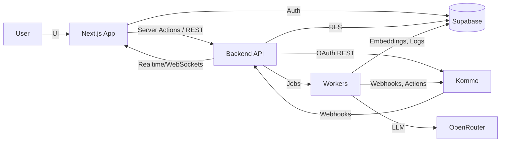

# Архитектура платформы GPT Agent

## 1. Общая концепция

Платформа предоставляет SaaS-сервис, где пользователь:

1. Регистрируется / входит в аккаунт и создаёт организацию (Supabase Auth + мультиарендная модель).
2. Подключает свою CRM (на первом этапе только Kommo) через OAuth 2.0.
3. Создаёт и обучает AI-агентов:
   - задаёт инструкции и правила поведения;
   - загружает документы → индексация, построение векторного и графового хранилища знаний;
   - настраивает каналы, воронки, триггеры, сценарии и интеграции;
   - выбирает модель в OpenRouter (GPT‑4.1, Claude, Llama и т. д.).
4. Агент работает внутри CRM: читает и обновляет сделки, переводит по этапам, создаёт задачи, общается с клиентами в чатах/почте, ведёт follow-up.
5. На дашборде отображается статистика использования (ответы, токены, каналы, ошибки) и доступны инструменты мониторинга / отладки диалогов.

## 2. Стек

| Слой | Технологии |
| --- | --- |
| UI | Next.js 14 App Router, React 18, Tailwind CSS, Lucide, Radix/Shadcn, App Router server actions |
| Auth & Data | Supabase (PostgreSQL + RLS + Storage + pgvector), Supabase Auth (email/SSO) |
| Backend | Node.js 20+, выделенный сервис (Fastify) для Kommo/AI/воркеров + Next.js API routes для лёгких операций |
| Коммуникации | Redis Streams / BullMQ для очередей, WebSockets (Supabase Realtime) |
| AI | OpenRouter API (модели GPT‑4.1/GPT‑4o-mini, Claude, Llama), LangChain/LLM orchestration, pgvector, Weaviate (опционально) |
| Файлы | Supabase Storage (сырьё) + Workers для chunking/embedding |
| Observability | OpenTelemetry, Supabase logs, Axiom/Sentry для ошибок |

## 3. Монорепозиторий

```
apps/
  web/                # Next.js App Router (текущий проект)
  api/                # Fastify/Node API (CRM, webhooks, AI orchestration)
packages/
  core/               # Общие типы, схемы Zod, сервисы
  workers/            # Очереди и планировщики (BullMQ)
  ai/                 # AI pipeline (LangChain, embeddings)
supabase/
  migrations/
  seeds/
docs/
  ARCHITECTURE.md
  KOMMO.md           # специфика Kommo API
```

> На первом шаге продолжаем работу в `apps/web`, затем выносим backend в `apps/api` с общими пакетами.

## 4. Модули платформы

### 4.1. Онбординг и мультиарендность

* Supabase Auth (email+password, OTP, Google SSO).
* Модели: `organizations`, `users`, `members`, `subscriptions`, `roles`.
* RLS: пользователь видит только данные своей организации.
* Billing-интеграция (Stripe/Paystack) для подсчёта токенов/ответов.

### 4.2. Управление подключениями Kommo

* OAuth 2.0 Authorization Code Flow:
  1. Пользователь инициирует подключение → перенаправление на Kommo.
  2. Callback принимает `code`, дергает `token` endpoint, сохраняет `access_token`, `refresh_token`, `base_domain`, `expires_in`.
  3. Токены шифруются (Supabase Vault / KMS) и хранятся в таблице `crm_connections`.
* Service layer `crm/kommoClient.ts`:
  - `getAccount`, `getLeads`, `getContacts`, `getUsers`, `getPipelines`, `getStatuses`;
  - `sendEmail`, `createNote`, `sendMessage` (мессенджеры), `scheduleTask`, `changeLeadStatus`;
  - `subscribeToWebhooks`/`unsubscribe` (создаём подписки на изменения сделок, сообщений, задач).
* Refresh token cron: воркер обновляет `access_token`, перезаписывает в БД.
* Каждая организация может иметь несколько подключений (несколько Kommo-аккаунтов под разными доменами).

### 4.3. AI платформенный слой

* **Модели**: передаём список моделей из OpenRouter API (запрос к `/models`). UI позволяет выбрать основную модель + fallback.
* **Prompt Studio**: редактор инструкций, persona, политика ответов, системные и пользовательские шаблоны.
* **Knowledge Base**: загрузка документов → обработка воркером:
  - chunking (tiktoken),
  - генерация embedding (OpenRouter embedding модель или OpenAI ada-002),
  - сохранение в `knowledge_chunks` (pgvector) с метаданными,
  - построение графа сущностей (Neo4j/pgGraph? На первом этапе используем Postgres + JSONB).
* **Memory**: хранение диалогов в `agent_conversations`, краткосрочная память в Redis, долгосрочная в Postgres + вектор.
* **Action Orchestration**: workflow движок (Temporal или собственный Rule Engine) для вызова действий (обновить сделку, создать задачу, отправить email).

### 4.4. Автоматизация и события

* **Rule Engine**: настройка правил «Если контекст X → сделать Y» (переход этапа, письмо, задача, уведомление).
* **Sequences**: последовательные follow-up (cron + шаблоны писем/сообщений).
* **Triggers**: реакция на события Kommo (webhook → worker → выполнение правил).

### 4.5. Мониторинг и аналитика

* **Usage Dashboard**: токены, количество ответов, активность по каналам, SLA.
* **Audit Trail**: логируем каждое действие агента (письмо, изменение этапа) в таблицу `agent_activity_logs`.
* **Error Handling**: Sentry + пользовательские уведомления (почта, Slack).

## 5. Data Flow



## 6. Supabase структура (черновик)

* `organizations`: id, name, slug, settings.
* `users`: id, email, hashed_password, metadata.
* `members`: org_id, user_id, role, status.
* `subscriptions`: org_id, plan, token_quota, expires_at.
* `crm_connections`: org_id, provider, base_domain, access_token (encrypted), refresh_token (encrypted), expires_at, scopes, metadata.
* `agents`: org_id, name, status, model_id, instructions, settings JSON, knowledge_status.
* `agent_assets`: agent_id, type (file/wiki/link), storage_path, processed_at.
* `knowledge_chunks`: agent_id, embedding vector, metadata, content.
* `agent_pipelines`, `agent_pipeline_stages`, `agent_channels` — выбранные воронки/этапы.
* `automations`, `automation_rules`, `automation_actions`.
* `agent_conversations`, `conversation_messages`, `message_tokens`.
* `agent_usage_daily`: ответы, токены, ошибки.
* `webhook_events`: raw payload, status.

## 7. Интеграция с Kommo

### 7.1. OAuth Flow

1. `/api/kommo/authorize?orgId=...` → редиректит на домен Kommo (пользователь вводит свой `base_domain`).
2. Kommo вызывает `/api/kommo/callback` с `code` + `referer`.
3. Backend получает токен (`/oauth/token`), сохраняет в `crm_connections`, создаёт webhook subscriptions.
4. Возвращаем пользователя в UI → проверяем статус соединения.

### 7.2. Используемые API Kommo

| Категория | Endpoint | Описание |
| --- | --- | --- |
| Аккаунт | `/api/v4/account` | Проверка токена, получение базовой информации |
| Пользователи | `/api/v4/users` | Список менеджеров, назначение ответственных |
| Воронки | `/api/v4/leads/pipelines`, `/statuses` | Получение воронок и статусов |
| Сделки | `/api/v4/leads`, `/api/v4/leads/{id}` | CRUD сделок, изменение этапов |
| Задачи | `/api/v4/tasks` | Создание и завершение задач |
| Примечания | `/api/v4/leads/notes` | Логирование действий агента |
| Коммуникации | `/api/v4/leads/chats`, `/api/v4/events` | Отправка сообщений в чатах, e-mail (через Kommo Mail) |
| Webhooks | `/api/v4/webhooks/subscribe` | События: создание/изменение сделки, входящее сообщение, новая задача |

### 7.3. Взаимодействие агента

* **Чтение контекста**: при новом сообщении/изменении сделки worker нормализует данные и сохраняет в `agent_conversations`.
* **Решение**: Rule Engine/LLM определяет намерение, выбирает действие (ответить, передвинуть сделку, создать задачу).
* **Действие**: через Kommo API выполняется операция. Результат логируется.
* **Обратная связь**: UI отображает таймлайн действий, позволяет менеджеру отклонить/подтвердить (human-in-the-loop).

## 8. AI Pipeline

1. **Context Builder**: собирает сведения из Kommo (сделка, контакт, история переписки, задачи, воронка).
2. **Knowledge Retriever**: запрашивает релевантные chunks из pgvector.
3. **Memory Retriever**: краткосрочная (последние сообщения) + долгосрочная (важные факты).
4. **LLM Planner**: через OpenRouter вызывает выбранную модель, формирует план действий (Chain of Thought + decision head).
5. **Action Executor**: если нужно действие → вызывает соответствующую функцию (Tool Invocation). Ответы клиенту формируются и отправляются через Kommo API.
6. **Evaluation**: результаты проверяются на политиках (не допускать запрещённых действий, валидация данных). Ошибки → человек.

## 9. Безопасность

* Секреты (OpenRouter, Supabase service role, Kommo client secret) храним в Vercel/Cloudflare Secrets + Supabase Vault.
* Токены Kommo шифруем (AES‑256) перед записью в БД, ключ в KMS.
* RLS, row level policies в Supabase для всех таблиц.
* Логи с персональными данными — в отдельной защищённой таблице, с ретеншеном и scrub.
* Поддержка GDPR: удаление данных по запросу (soft delete → hard delete worker).

## 10. Roadmap (short)

1. **Фаза 0**: настроить Supabase (схема, миграции), подготовить окружение (infra as code, secrets), описать Kommo клиент.
2. **Фаза 1**: реализовать Kommo OAuth + хранение токенов + webhooks, UI подключения, базовый дашборд.
3. **Фаза 2**: AI knowledge pipeline (загрузка файлов, embeddings, retrieval), выбор модели (OpenRouter), генерация ответов без действий.
4. **Фаза 3**: Действия агента (перемещение сделки, задачи, письма), rule engine, мониторинг.
5. **Фаза 4**: sequences, расширенные интеграции каналов, billing.
6. **Фаза 5**: дополнительные CRM, marketplace инструментов, DevOps (CI/CD, Terraform, observability).

---

Следующие шаги:

1. Спроектировать таблицы Supabase (SQL миграции, seed).
2. Подготовить Backend сервис (Fastify) с Kommo OAuth и webhooks.
3. В App Router реализовать онбординг корп. клиента + подключение Kommo + выбор модели.
4. Настроить MCP / удалить устаревшие материалы.
